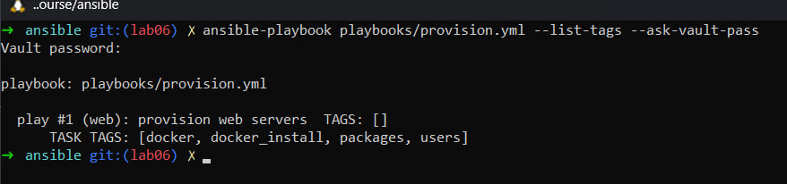
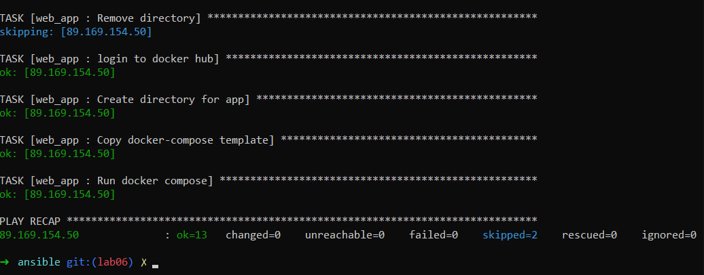
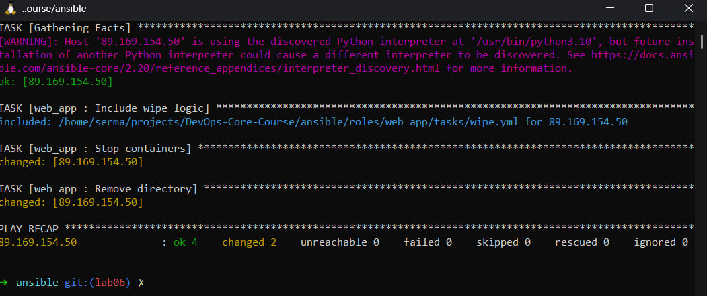
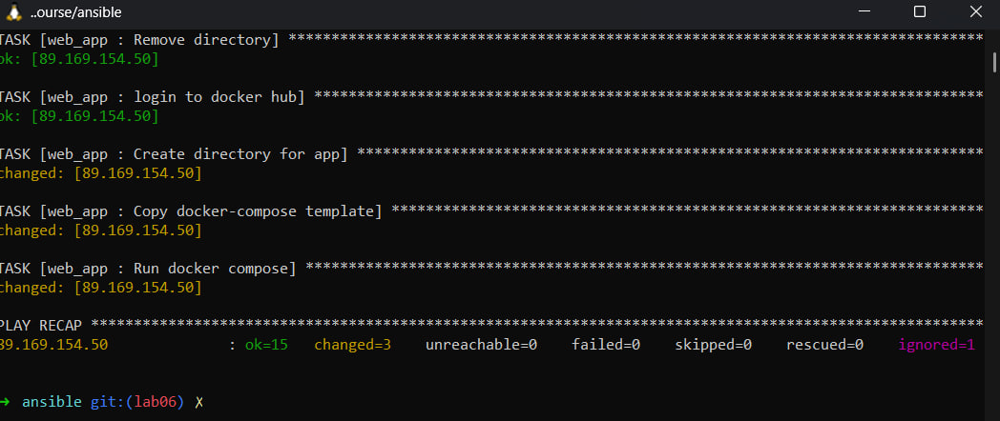
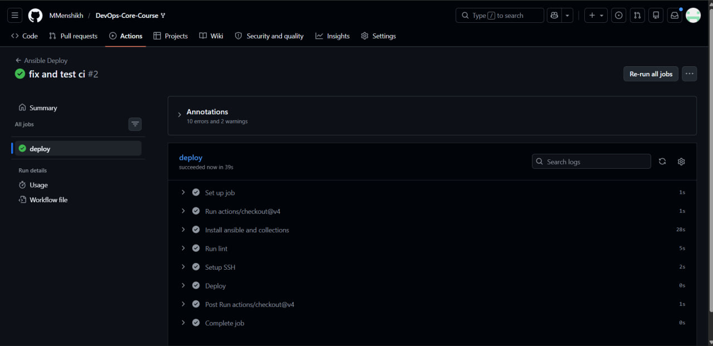

# Lab 6: Advanced Ansible & CI/CD - Submission


## Overview

In this lab, I enhanced my Ansible automation by introducing advanced
features such as blocks, tags, Docker Compose deployment, wipe logic,
and CI/CD integration using GitHub Actions.

Technologies used: - Ansible 2.16+ - Docker & Docker Compose v2 - GitHub
Actions - Jinja2 templating

------------------------------------------------------------------------

## Blocks & Tags

### Implementation

I refactored roles using Ansible blocks to group tasks and improve
readability. Each block includes: - `block` for main tasks - `rescue`
for error handling - `always` for cleanup/logging

Tags were applied for selective execution: - `packages`, `users` in
common role - `docker_install`, `docker_config` in docker role

### Example Execution

``` bash
ansible-playbook playbooks/provision.yml --tags docker --ask-vault-pass

ansible-playbook playbooks/provision.yml --list-tags --ask-vault-pass
```

### Evidence



------------------------------------------------------------------------

## Docker Compose Migration

### Changes

-   Replaced `docker run` with Docker Compose
-   Created Jinja2 template for docker-compose.yml
-   Added role dependency on docker

### Template Example

``` yaml
services:
  app:
    image: "{{ docker_image }}:{{ docker_tag }}"
    container_name: "{{ app_name }}"
    ports:
      - "{{ app_port }}:{{ app_internal_port }}"
    restart: unless-stopped
```

------------------------------------------------------------------------

## Wipe Logic

### Implementation

-   Controlled by variable: `web_app_wipe`
-   Triggered only with tag: `web_app_wipe`
-   Ensures safe deletion

### Scenarios Tested

1.  Normal deploy → wipe skipped\
2.  Wipe only → app removed\
3.  Wipe + deploy → clean reinstall\

### Evidence







------------------------------------------------------------------------

## CI/CD Integration

### Workflow

-   Trigger on push to ansible directory
-   Run ansible-lint
-   Deploy using ansible-playbook
-   Verify via curl

### Evidence




------------------------------------------------------------------------

## Challenges & Solutions

### Issue: Docker not installed before deploy

Solution: Added role dependency in meta/main.yml

### Issue: Wipe executed accidentally

Solution: Added double condition (variable + tag)

------------------------------------------------------------------------

## Research Answers

**Q: What happens if rescue fails?**\
A: Play fails completely.

**Q: Can you nest blocks?**\
A: Yes, blocks can be nested.

**Q: How do tags inherit?**\
A: Tags applied to blocks propagate to all tasks inside.

**Q: Why variable + tag for wipe?**\
A: Prevents accidental destructive actions.

**Q: Difference between restart policies?**\
A: `always` restarts always, `unless-stopped` respects manual stop.

------------------------------------------------------------------------

## Summary

This lab helped me understand advanced Ansible patterns, safe deployment
practices, and CI/CD automation.
