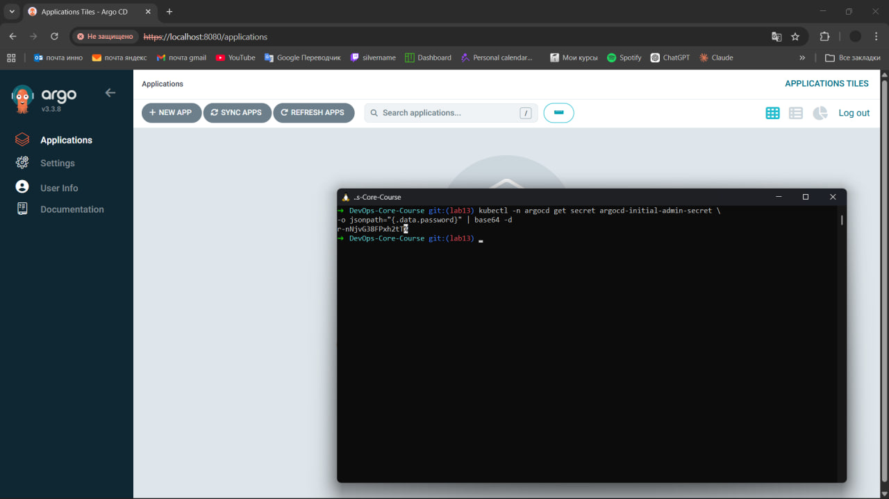
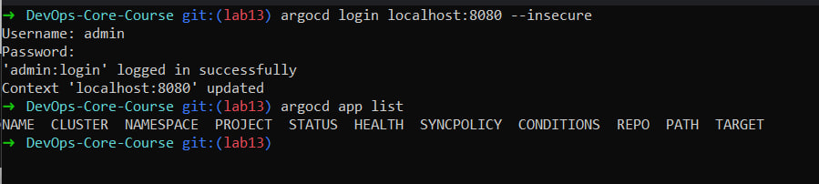
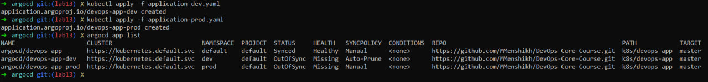
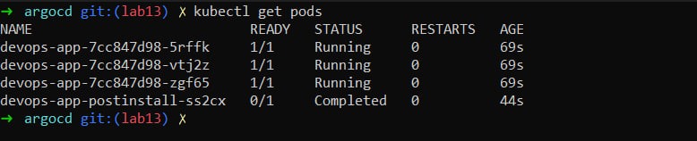
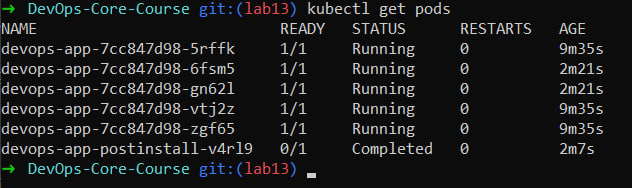
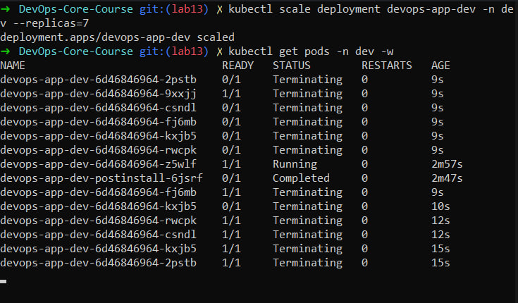
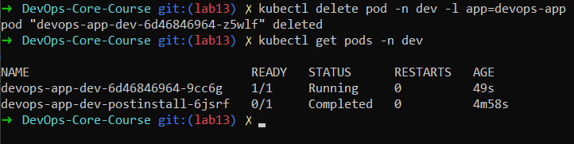
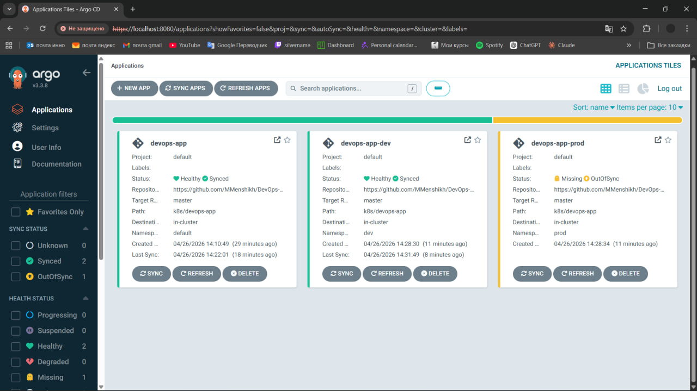

# ArgoCD Setup

---

## Installation Verification

ArgoCD was installed using Helm and deployed into the `argocd` namespace.  
All components are running successfully, as confirmed in the screenshot:

---

## UI Access Method

Port-forwarding was configured:

```bash
kubectl port-forward svc/argocd-server -n argocd 8080:443
```

**Access URL:**  
[https://localhost:8080](https://localhost:8080)

**Credentials:**

- Username: `admin`
- Password: Retrieved from Kubernetes secret

Confirmed on screenshot:



---

## CLI Configuration

Login via CLI:

```bash
argocd login localhost:8080 --insecure
```

Connection was successfully established.  
**Evidence:**



---

## Application Configuration

### Application Manifests

Three Application resources were created:

- `application.yaml` (default)
- `application-dev.yaml`
- `application-prod.yaml`

### Source Configuration

- **Repository:** [https://github.com/MMenshikh/DevOps-Core-Course](https://github.com/MMenshikh/DevOps-Core-Course)
- **Branch:** `master`
- **Path:** `k8s/devops-app`

Helm is used for deployment with environment-specific values files.

### Destination Configuration

- **Cluster:** `https://kubernetes.default.svc`
- **Namespaces:**
  - `default`
  - `dev`
  - `prod`

### Values File Selection


| Environment | Values File        |
| ----------- | ------------------ |
| default     | `values.yaml`      |
| dev         | `values-dev.yaml`  |
| prod        | `values-prod.yaml` |


---

## Multi-Environment Namespace Separation

Namespaces created:

```bash
kubectl get ns
```

**Output confirms:**

- `dev`
- `prod`

**Screenshot:**



---

## Configuration Differences


| Feature      | Dev       | Prod     |
| ------------ | --------- | -------- |
| Sync         | Automatic | Manual   |
| Self-healing | Enabled   | Disabled |
| Prune        | Enabled   | Disabled |


### Sync Policy Differences

**Dev (Auto-sync enabled):**

```yaml
syncPolicy:
  automated:
    prune: true
    selfHeal: true
```

**Prod (Manual):**

```yaml
syncPolicy:
  syncOptions:
    - CreateNamespace=true
```

**Rationale:**  
Production uses manual sync because:

- Safer deployments
- Change review before release
- Better control over downtime
- Rollback planning

**Screenshots:**




---

## Self-Healing Evidence

### Manual Scale Test

**Command:**

```bash
kubectl scale deployment devops-app-dev -n dev --replicas=5
```

**Result:**  
ArgoCD detected drift and automatically reverted replicas back.

### Pod Deletion Test

**Command:**

```bash
kubectl delete pod -n dev -l app.kubernetes.io/name=devops-app
```

**Result:**  
Pod recreated automatically by Kubernetes.

**Screenshots:**




### Configuration Drift Test

**Manual modification** was applied to a resource.

**Result:**  
ArgoCD detected the difference and automatically reverted the state to match Git.

### Behavior Explanation


| Mechanism  | Responsibility          |
| ---------- | ----------------------- |
| Kubernetes | Pod recovery            |
| ArgoCD     | Config drift correction |


---

### Screenshots

- **ArgoCD UI Login**


- **ArgoCD CLI Login**


- **Initial Sync Result**


- **GitOps Flow: Update after Git Changes**


- **Multi-environment Deployment (Dev & Prod)**


- **Self-Healing: Manual Scaling (Drift Detected)**


- **Self-Healing: Automatic Revert to Git State**


- **ArgoCD Dashboard Overview**



---

## Summary

This lab demonstrates a full GitOps workflow:

- Git as the source of truth
- ArgoCD continuous reconciliation
- Multi-environment deployment
- Automatic self-healing in dev
- Controlled releases in production