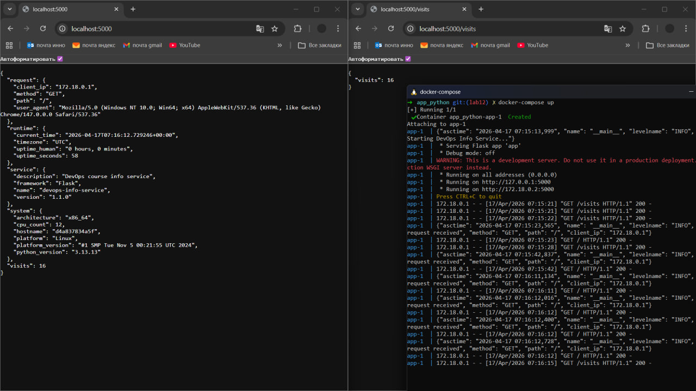
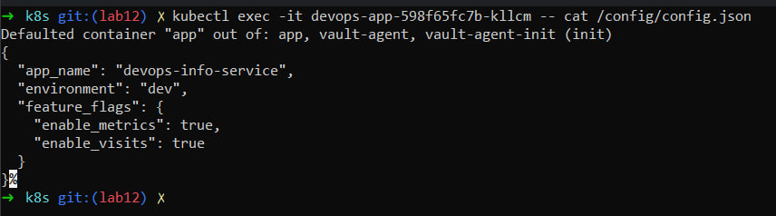
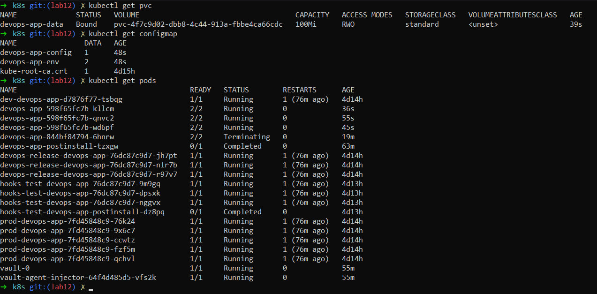
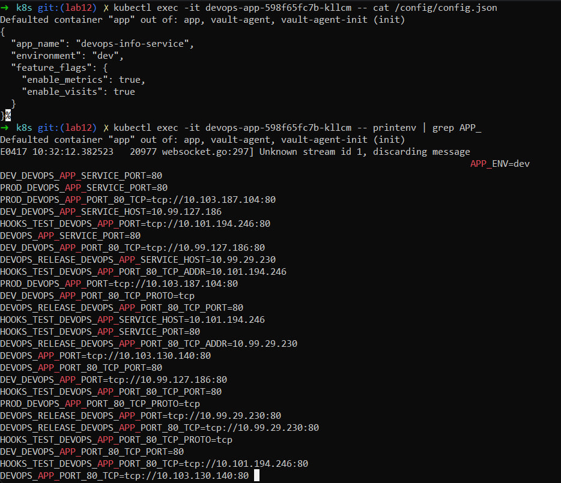
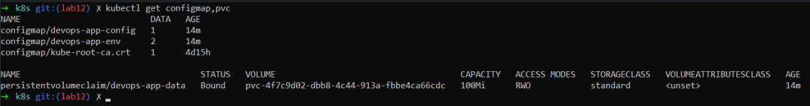

## 1. Application Changes

### Visits Counter Implementation

The application was extended to support persistent visit counting:

-   A file `/data/visits` is used to store the counter
-   Each request to `/`:
    1.  Reads current value
    2.  Increments it
    3.  Writes it back to file
-   Thread safety is ensured using a lock

### New Endpoint

-   `/visits` endpoint returns current number of visits:

``` json
{
  "visits": <number>
}
```

### Local Testing with Docker

-   Volume was mounted using docker-compose:

``` yaml
volumes:
  - ./data:/app/data
```

-   Verified:
    -   Counter increases with requests
    -   After container restart, value persists

** Screenshot:**



------------------------------------------------------------------------

## 2. ConfigMap Implementation

### config.json

``` json
{
  "app_name": "devops-info-service",
  "environment": "dev",
  "feature_flags": {
    "enable_metrics": true,
    "enable_visits": true
  }
}
```

### ConfigMap Template (File-based)

``` yaml
apiVersion: v1
kind: ConfigMap
metadata:
  name: {{ include "devops-app.fullname" . }}-config
data:
  config.json: |-
{{ .Files.Get "files/config.json" | indent 4 }}
```

### ConfigMap Template (Environment Variables)

``` yaml
apiVersion: v1
kind: ConfigMap
metadata:
  name: {{ include "devops-app.fullname" . }}-env
data:
  APP_ENV: "dev"
  LOG_LEVEL: "info"
```

### Mounting ConfigMap as File

In deployment:

``` yaml
volumes:
  - name: config-volume
    configMap:
      name: {{ include "devops-app.fullname" . }}-config

volumeMounts:
  - name: config-volume
    mountPath: /config
```

### Using ConfigMap as Environment Variables

``` yaml
envFrom:
  - configMapRef:
      name: {{ include "devops-app.fullname" . }}-env
```

### Verification

-   File inside pod:

``` bash
kubectl exec <pod> -- cat /config/config.json
```

-   Environment variables:

``` bash
kubectl exec <pod> -- printenv | grep APP_
```

** Screenshot:**



------------------------------------------------------------------------

## 3. Persistent Volume

### PVC Configuration

-   Storage: 100Mi
-   Access Mode: ReadWriteOnce (RWO)
-   StorageClass: default (Minikube provisioned)

### Volume Mount

``` yaml
volumes:
  - name: data-volume
    persistentVolumeClaim:
      claimName: {{ include "devops-app.fullname" . }}-data

volumeMounts:
  - name: data-volume
    mountPath: /data
```

### Persistence Test

Steps:

1.  Get current visits:

``` bash
curl <service>/visits
```

2.  Delete pod:

``` bash
kubectl delete pod <pod-name>
```

3.  Wait for new pod

4.  Check visits again:

``` bash
curl <service>/visits
```

Result: - Counter value remained unchanged → persistence works

** Screenshots:**





------------------------------------------------------------------------

## 4. ConfigMap vs Secret

  Feature     ConfigMap       Secret
  ----------- --------------- -------------
  Data type   Non-sensitive   Sensitive
  Encoding    Plain text      Base64
  Use case    Config          Credentials

### When to use ConfigMap

-   Application settings
-   Feature flags
-   Environment configuration

### When to use Secret

-   Passwords
-   API keys
-   Tokens

### Key Difference

ConfigMaps are not secure and should NOT store sensitive data. Secrets
provide basic protection and should be used for credentials.

------------------------------------------------------------------------

## Conclusion

-   ConfigMaps successfully externalize configuration
-   PVC ensures data persistence across pod restarts
-   Application state (visits counter) survives failures
-   Clear separation between config (ConfigMap) and secrets (Vault/K8s
    Secret)
