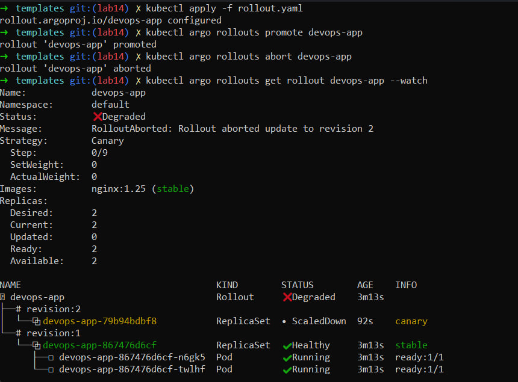
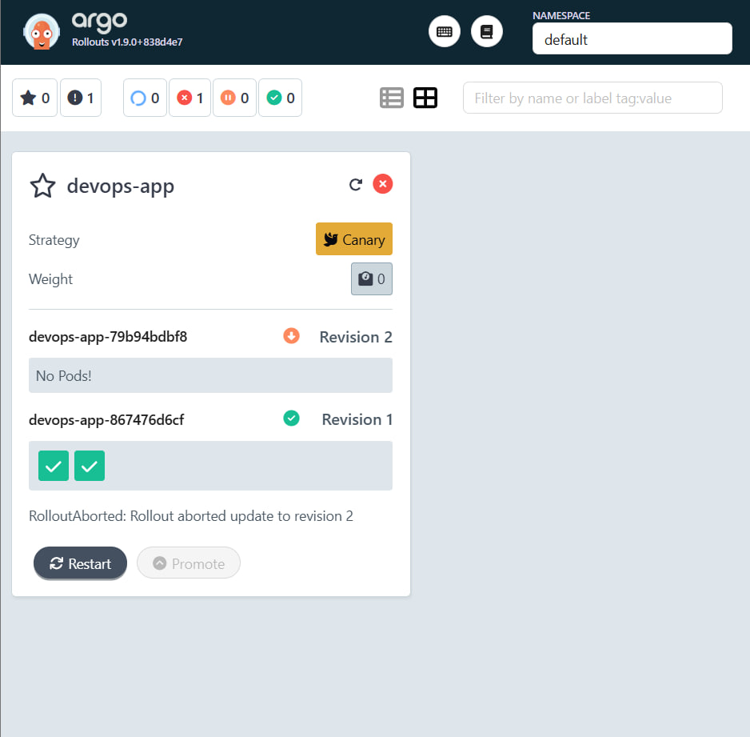
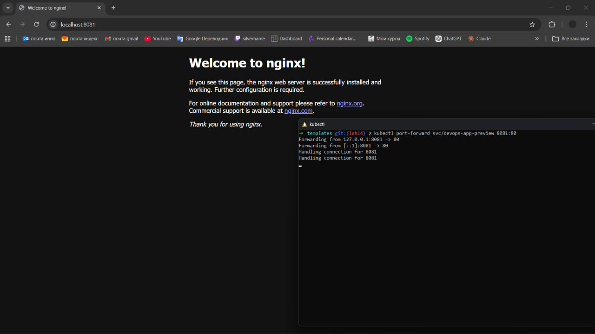

# Progressive Delivery with Argo Rollouts

## 1. Argo Rollouts Setup

Argo Rollouts controller was installed in the Kubernetes cluster using
official manifests and verified by checking running pods in the
`argo-rollouts` namespace.

The Argo Rollouts Dashboard was deployed and accessed via
port-forwarding:

    kubectl port-forward svc/argo-rollouts-dashboard -n argo-rollouts 3100:3100

The dashboard was successfully opened in the browser
(`http://localhost:3100`) and the rollout resource was visible.

------------------------------------------------------------------------

## 2. Canary Deployment

Although the final configuration uses Blue-Green strategy, canary
behavior was tested conceptually through rollout updates.

### Process:

-   The container image was updated (e.g., `nginx:1.25 → nginx:1.26`)
-   Rollout progression was observed in the dashboard
-   Manual promotion was executed:

```{=html}
<!-- -->
```
    kubectl argo rollouts promote devops-app

-   Rollout abort (rollback) was tested:

```{=html}
<!-- -->
```
    kubectl argo rollouts abort devops-app

### Observations:

-   Promotion advances rollout to next stage
-   Abort immediately restores previous stable version
-   Dashboard visualizes rollout steps and status clearly

------------------------------------------------------------------------

## 3. Blue-Green Deployment

### Configuration

Rollout uses Blue-Green strategy:

-   **Active Service:** `devops-app`
-   **Preview Service:** `devops-app-preview`
-   **Auto Promotion:** Disabled (manual promotion required)

### Services

-   Active service routes production traffic
-   Preview service exposes the new version for testing before promotion

### Testing Flow

1.  Initial deployment (Blue version)
2.  Update image → new version deployed to preview
3.  Access services:
    -   Active:

            kubectl port-forward svc/devops-app 8080:80

    -   Preview:

            kubectl port-forward svc/devops-app-preview 8081:80
4.  Validate new version on preview
5.  Promote:

```{=html}
<!-- -->
```
    kubectl argo rollouts promote devops-app

### Observations:

-   Traffic switches instantly after promotion
-   No gradual shift like canary
-   Requires double resources during deployment

------------------------------------------------------------------------

## 4. Strategy Comparison

  -----------------------------------------------------------------------
  Feature         Canary Deployment          Blue-Green Deployment
  --------------- -------------------------- ----------------------------
  Traffic Shift   Gradual (percentage)       Instant (all-at-once)

  Risk            Lower (safe testing)       Higher (full switch)

  Complexity      Higher                     Simpler

  Resources       Efficient                  Requires double capacity

  Rollback        Gradual or manual          Instant
  -----------------------------------------------------------------------

### Recommendation

-   Use **Canary** for production systems where risk must be minimized
-   Use **Blue-Green** for fast deployments with easy rollback

------------------------------------------------------------------------

## 5. CLI Commands Reference

### Monitoring

    kubectl argo rollouts get rollout devops-app -w

### Promotion

    kubectl argo rollouts promote devops-app

### Abort / Rollback

    kubectl argo rollouts abort devops-app

### Retry Rollout

    kubectl argo rollouts retry devops-app

------------------------------------------------------------------------

## 6. Artifacts & Screenshots

### Rollout State


*Snapshot of the initial Rollout resource creation and status verification via CLI.*

### Promotion and Abort Actions


*Evidence of manual promotion and rollback (abort) commands during the Canary lifecycle.*

### Dashboard UI


*Argo Rollouts Dashboard visualization showing the active revisions and traffic weight distribution.*

### Preview Service Test


*Successful verification of the new version accessible through the dedicated Preview Service on port 8081.*


------------------------------------------------------------------------

## Conclusion

Argo Rollouts enables safe and flexible progressive delivery
strategies.\
In this lab, Blue-Green deployment was successfully implemented with
preview validation and instant promotion, while rollout control
operations (promote/abort) were tested and verified.
