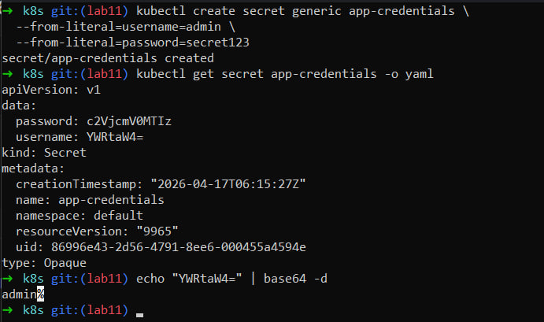
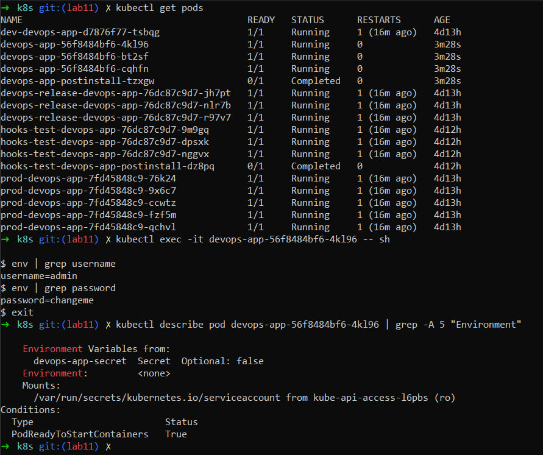
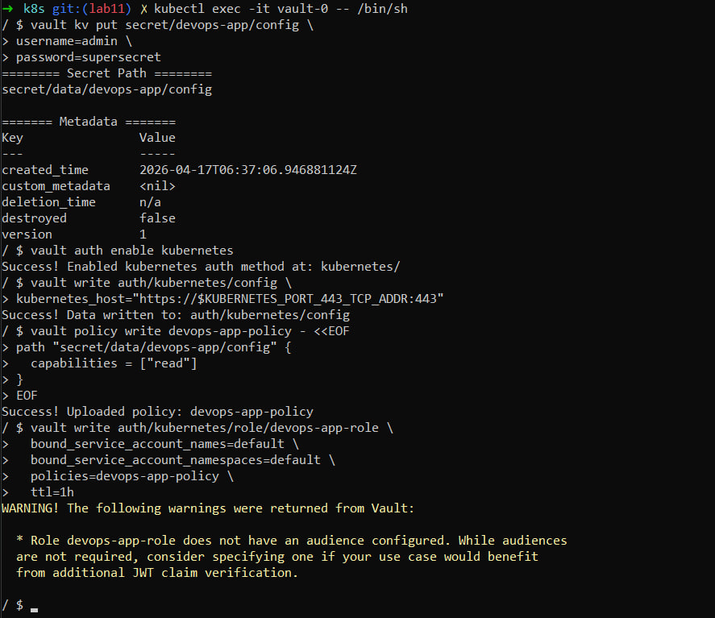
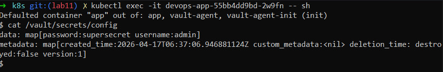

# Lab 11 — Kubernetes Secrets & HashiCorp Vault

## 1. Kubernetes Secrets

### Secret Creation

A Kubernetes Secret named `app-credentials` was created using the imperative command:

```bash
kubectl create secret generic app-credentials \
  --from-literal=username=admin \
  --from-literal=password=changeme
```

### Secret Inspection

The secret was inspected using:

```bash
kubectl get secret app-credentials -o yaml
```

The values are stored in **base64-encoded format**.

### Decoding Values

Example decoding:

```bash
echo YWRtaW4= | base64 -d
# Output: admin
```

```bash
echo Y2hhbmdlbWU= | base64 -d
# Output: changeme
```

### Encoding vs Encryption

* **Base64 encoding** is NOT encryption — it is easily reversible.
* Kubernetes Secrets are only encoded by default.
* For real security:

  * Enable **etcd encryption at rest**
  * Use **RBAC** to restrict access
  * Use external tools like **Vault**

### Evidence

* `task1.png` — Secret creation and inspection
* Shows encoded values and decoding process

---

## 2. Helm Secret Integration

### Secret Template

File: `templates/secrets.yaml`

```yaml
apiVersion: v1
kind: Secret
metadata:
  name: {{ include "devops-app.fullname" . }}-secret
type: Opaque

stringData:
  username: {{ .Values.secrets.username }}
  password: {{ .Values.secrets.password }}
```

### Values Configuration

Secrets are defined in `values.yaml`:

```yaml
secrets:
  username: "admin"
  password: "changeme"
```

### Injecting Secrets into Pod

Secrets are injected using `envFrom`:

```yaml
envFrom:
  - secretRef:
      name: {{ include "devops-app.fullname" . }}-secret
```

This exposes all keys (`username`, `password`) as environment variables.

### Verification

Secrets were verified inside the pod using:

```bash
kubectl exec -it <pod> -- printenv
```

Environment variables from the secret were successfully available.

### Evidence

* `task2.png` — Shows environment variables inside the container

---

## 3. Resource Management

Resource limits and requests are defined in `values.yaml`:

```yaml
resources:
  limits:
    cpu: 300m
    memory: 256Mi
  requests:
    cpu: 100m
    memory: 128Mi
```

### Explanation

* **Requests**: Minimum resources guaranteed to the container
* **Limits**: Maximum resources the container can use

### Why This Matters

* Prevents resource starvation
* Ensures fair scheduling
* Improves cluster stability

---

## 4. Vault Integration

### Vault Installation

Vault was installed using Helm in development mode with injector enabled.

Verification:

```bash
kubectl get pods
```

Vault components (server and injector) were running successfully.

---

### Vault Secret Configuration

A KV v2 secrets engine was enabled and secrets were created:

```bash
vault kv put secret/devops-app/config username="admin" password="changeme"
```

---

### Kubernetes Authentication

* Kubernetes auth method was enabled
* A policy was created allowing read access to:

```
secret/data/devops-app/config
```

* A role `devops-app-role` was created and bound to the application's ServiceAccount

---

### Vault Agent Injection

Deployment annotations:

```yaml
annotations:
  vault.hashicorp.com/agent-inject: "true"
  vault.hashicorp.com/role: "devops-app-role"
  vault.hashicorp.com/agent-inject-secret-config: "secret/data/devops-app/config"
```

### How It Works

* Vault Agent runs as a sidecar container
* It authenticates using Kubernetes ServiceAccount
* It fetches secrets from Vault
* It injects them into the pod filesystem

---

### Verification

Secrets were successfully injected into the pod:

```bash
kubectl exec -it <pod> -- ls /vault/secrets
```

A file containing secrets was available inside the container.

---

### Evidence

* `vault-commands.png` — Vault setup and commands
* `vault-secrets-config.png` — Secret configuration and usage

---

## 5. Security Analysis

### Kubernetes Secrets vs Vault

| Feature        | Kubernetes Secrets | Vault                   |
| -------------- | ------------------ | ----------------------- |
| Storage        | etcd               | External secure storage |
| Encryption     | Optional           | Built-in                |
| Access Control | RBAC               | Fine-grained policies   |
| Rotation       | Manual             | Automatic               |
| Injection      | Env vars / volumes | Sidecar injection       |

---

### When to Use Each

**Kubernetes Secrets:**

* Simple applications
* Non-critical data
* Development environments

**Vault:**

* Production systems
* Sensitive credentials
* Dynamic secrets
* Secret rotation required

---

### Production Recommendations

* Enable **etcd encryption**
* Avoid storing secrets in Git
* Use **Vault or external secret managers**
* Implement **RBAC policies**
* Use **short-lived credentials**

---

## Conclusion

In this lab:

* Kubernetes Secrets were created and analyzed
* Helm chart was extended to manage secrets
* Secrets were injected into pods via environment variables
* HashiCorp Vault was deployed and configured
* Vault Agent injection was successfully implemented

This demonstrates a transition from basic secret handling to production-grade secret management.

---

## Screenshots

### Task 1: Kubernetes Secrets


### Task 2: Environment Variables


### Vault Configuration


### Vault Injection Result

