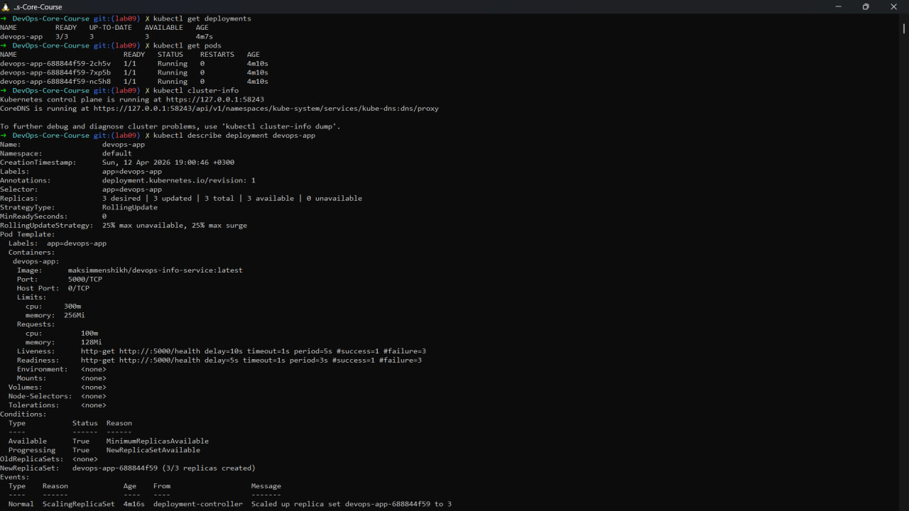
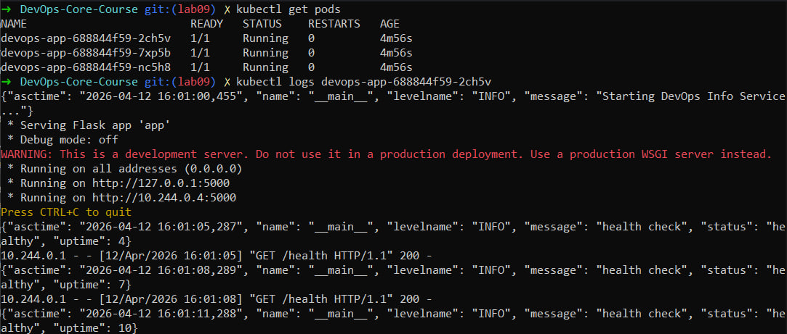
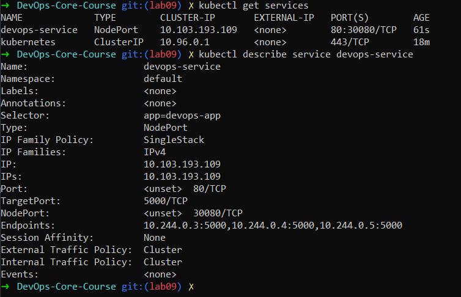
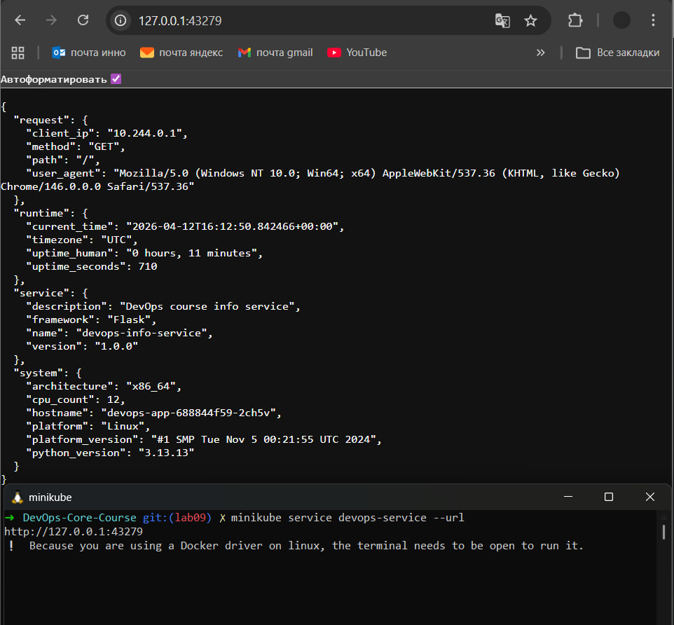
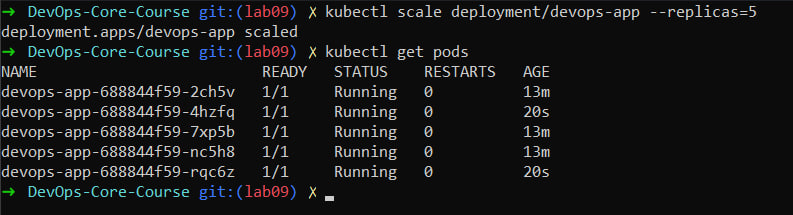
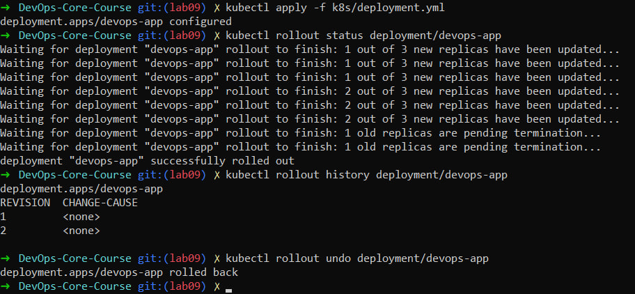
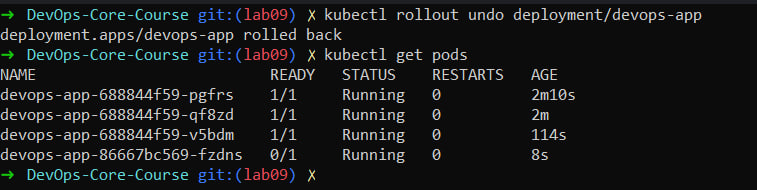

# Lab 9 — Kubernetes Fundamentals

## 1. Architecture Overview

This lab demonstrates deployment of a containerized application in Kubernetes using a local cluster (minikube).

Architecture:

User → NodePort Service → Deployment → Pods (3–5 replicas)

- A Deployment manages multiple Pods running the application
- A Service exposes the Pods via a stable endpoint
- Kubernetes ensures desired state (replicas, health, updates)

Resource strategy:
- CPU and memory limits applied to prevent resource overuse
- Horizontal scaling used for load handling

---

## 2. Manifest Files

### Deployment (`k8s/deployment.yml`)
Defines:
- 3 replicas (scaled to 5 later)
- Docker image: `maksimmenshikh/devops-info-service`
- Resource requests and limits
- Liveness and readiness probes (`/health` endpoint)

Key decisions:
- 3 replicas for high availability
- Health checks to ensure reliability
- Resource limits for stability

### Service (`k8s/service.yml`)
Defines:
- Type: NodePort
- Exposes application externally
- Maps port 80 → container port 5000

---

## 3. Deployment Evidence

The application was successfully deployed and verified.

Commands used:
```
kubectl get all
kubectl get pods
kubectl get services
kubectl describe deployment devops-app
```

Results:
- All Pods running and healthy
- Service accessible via minikube
- Deployment strategy confirmed

---

## 4. Operations Performed

### Deployment
```
kubectl apply -f k8s/deployment.yml
kubectl apply -f k8s/service.yml
```

### Scaling
```
kubectl scale deployment/devops-app --replicas=5
```

Result:
- Deployment scaled from 3 to 5 Pods

### Rolling Update
- Image updated from `latest` → `lab02`

```
kubectl apply -f k8s/deployment.yml
kubectl rollout status deployment/devops-app
```

Result:
- Pods updated gradually with no downtime

### Rollback
```
kubectl rollout undo deployment/devops-app
```

Result:
- Previous version restored successfully

### Service Access
```
minikube service devops-service
```

- Application accessible in browser
- Endpoints verified working

---

## 5. Production Considerations

### Health Checks
- Liveness probe: detects broken containers
- Readiness probe: ensures traffic goes only to ready Pods

### Resource Limits
- Prevents resource exhaustion
- Ensures fair scheduling

### Improvements for Production
- Use Ingress instead of NodePort
- Add TLS (HTTPS)
- Use Horizontal Pod Autoscaler
- Add monitoring (Prometheus + Grafana from previous labs)

### Observability
- Logs: Loki (Lab 7)
- Metrics: Prometheus (Lab 8)

---

## 6. Testing Results

The following tests were performed:

- Verified Pods are running and healthy
- Verified Service connectivity
- Performed scaling to 5 replicas
- Executed rolling update
- Verified rollback functionality

All operations completed successfully.

---

## 7. Screenshots

### Deployment and Pods Describe


### Pods Health Check


### Service Info


### Service Check (Accessing the App)


### Scaling the Deployment


### Rollout Process


### Rollback Process



---

## 8. Challenges & Solutions

No significant issues were encountered during this lab.

Minor challenges included:
- Understanding Kubernetes architecture
- Learning kubectl commands

Solutions:
- Used official documentation
- Verified each step with kubectl commands

---

## 9. Kubernetes Concepts

### What is a Pod?
Smallest deployable unit in Kubernetes containing one or more containers.

### What is a Deployment?
Manages Pods, scaling, and rolling updates.

### What is a Service?
Provides stable networking and access to Pods.

### Declarative vs Imperative
- Declarative: define desired state (YAML + `apply`)
- Imperative: manual commands (`scale`, `delete`)

Kubernetes continuously reconciles actual state with desired state.

---

## Conclusion

A production-style Kubernetes deployment was successfully implemented using best practices such as health checks, resource limits, and rolling updates. The system demonstrated scalability, reliability, and maintainability in a container orchestration environment.
