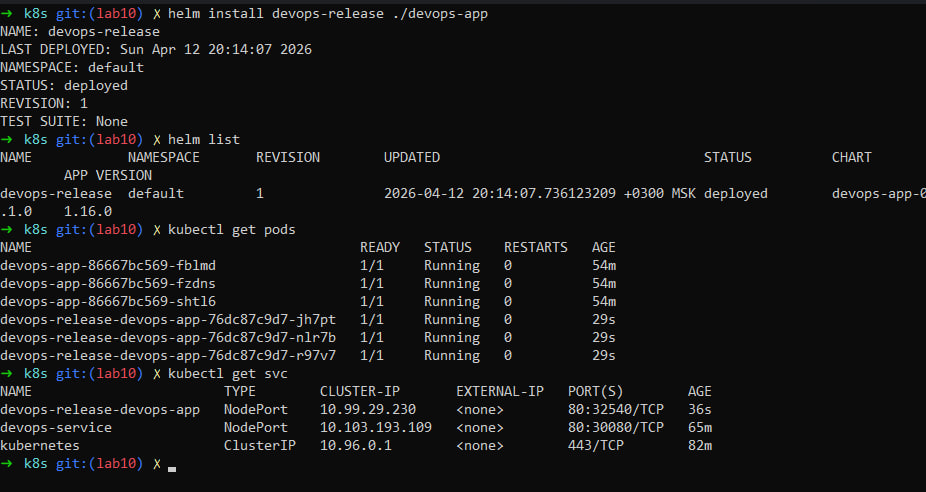
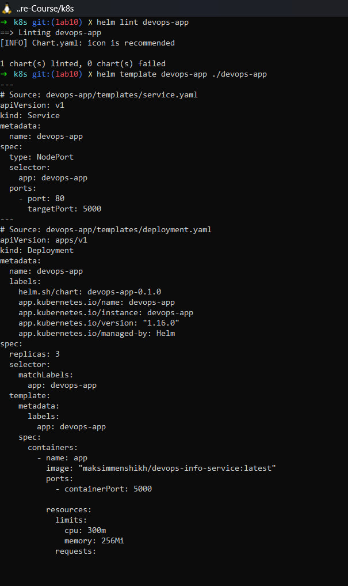
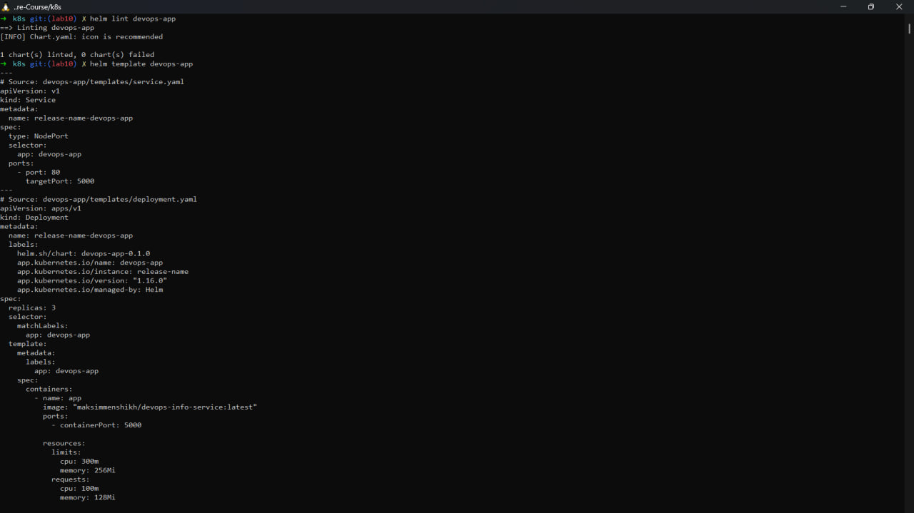
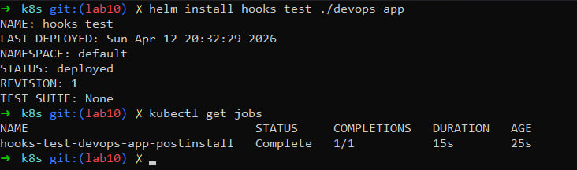
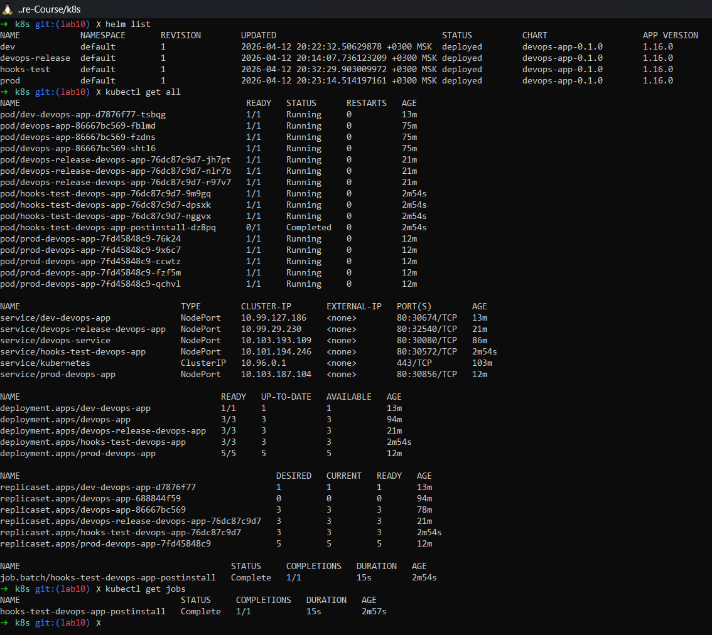
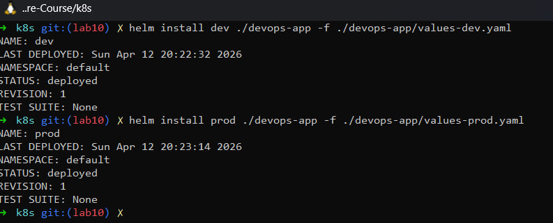

# Lab 10 — Helm Package Manager

## Overview
In this lab, I transformed Kubernetes manifests from Lab 9 into a reusable Helm chart. The chart supports multiple environments (dev/prod), uses templating, and implements lifecycle hooks.

---

## Helm Fundamentals

Helm was installed and verified:

```
helm version
```

Explored public charts:
```
helm repo add prometheus-community https://prometheus-community.github.io/helm-charts
helm repo update
helm show chart prometheus-community/prometheus
```


Helm simplifies Kubernetes deployments using templating, versioning, and reusable configurations.

---

### Chart Structure

```text
k8s/devops-app/
├── Chart.yaml
├── values.yaml
├── values-dev.yaml
├── values-prod.yaml
├── templates/
│   ├── deployment.yaml
│   ├── service.yaml
│   └── _helpers.tpl
└── hooks/
```
---

## Configuration (values.yaml)

```yaml
replicaCount: 3

image:
  repository: maksimmenshikh/devops-info-service
  tag: "latest"

service:
  type: NodePort
  port: 80
  targetPort: 5000
```


### Environment Differences

**Dev:**
- 1 replica
- lower resources
- latest image

**Prod:**
- 5 replicas
- higher resources
- fixed image tag (`lab02`)

---

## Deployment & Service Templates

### Deployment
- replicas configured via values
- image configurable
- resource limits and requests
- liveness and readiness probes enabled

### Service
- type: NodePort
- configurable ports

---

## Hooks Implementation

### Pre-install Hook
- Executes before deployment
- Simulates preparation step

### Post-install Hook
- Executes after deployment
- Simulates validation

### Annotations

helm.sh/hook: pre-install / post-install
helm.sh/hook-delete-policy: hook-succeeded

---

## Installation & Testing

### Lint & Template

```bash
helm lint ./devops-app
helm template devops-app ./devops-app
```

### Install

```bash
helm install devops-app ./devops-app
```

### Dev Deployment

```bash
helm install dev ./devops-app -f ./devops-app/values-dev.yaml
```

### Prod Deployment

```bash
helm install prod ./devops-app -f ./devops-app/values-prod.yaml
```


---

## Operations

### List Releases

```bash
helm list
```

---

## Evidence

### Kubernetes Installation


### Helm Initialization


### Helm Lint and Template Check


### Helm Hooks Test


### List All Jobs (Hooks Verification)


### Dev and Prod Values Comparison



---

## Testing & Validation

- helm lint passed successfully
- templates rendered correctly
- hooks executed successfully
- hooks deleted after execution
- application accessible via NodePort

---

## Conclusion

Helm provides a powerful way to package Kubernetes applications. Using templates, values, and hooks allows creating reusable, configurable, and production-ready deployments.