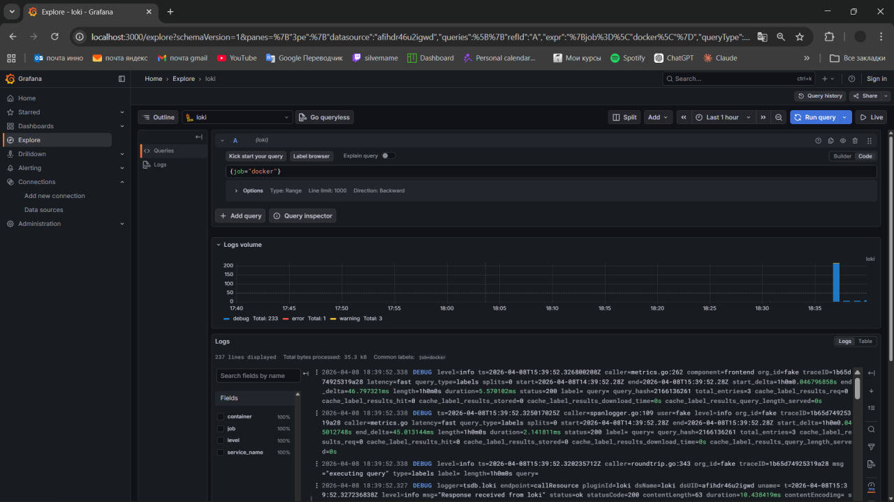
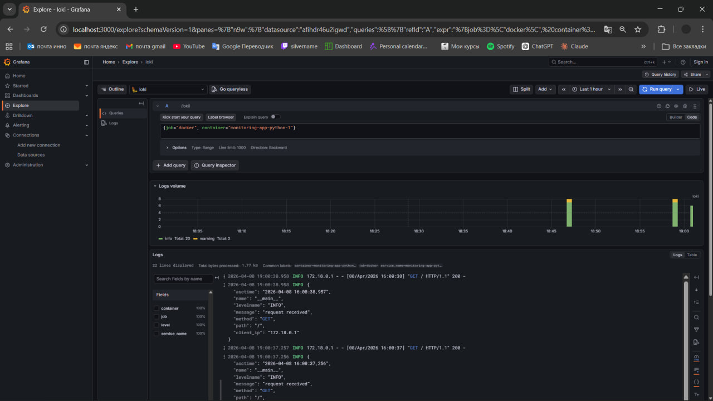
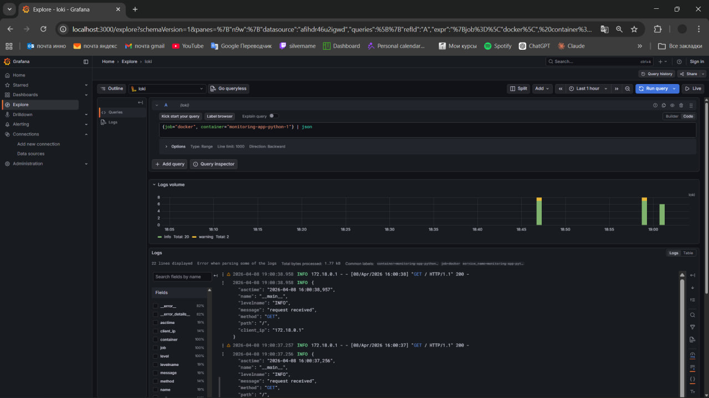
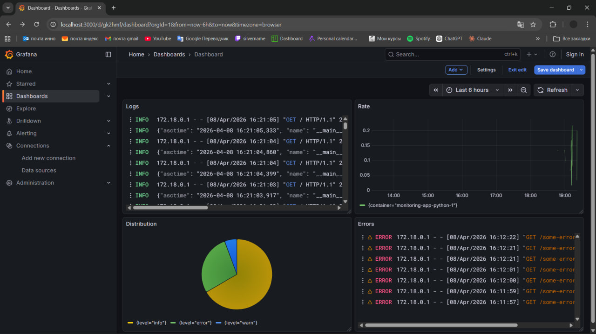
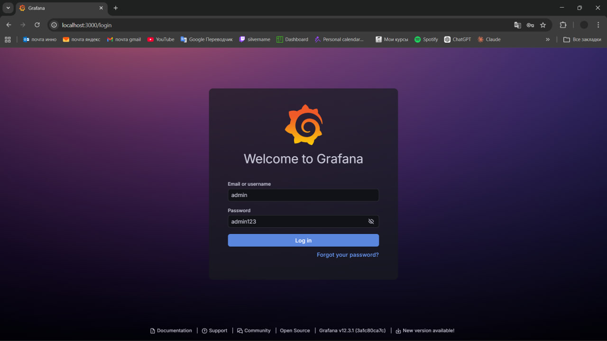
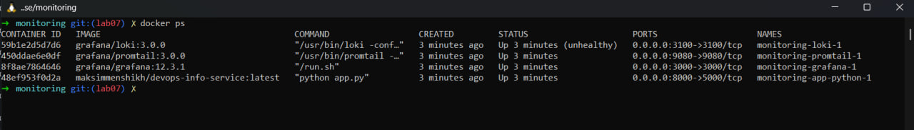

# Lab 7 — Observability & Logging with Loki Stack

## 1. Architecture

This project deploys a centralized logging system using:
- Loki (log storage)
- Promtail (log collector)
- Grafana (visualization)

Flow:
Containers → Promtail → Loki → Grafana

Promtail discovers Docker containers and sends logs to Loki. Grafana queries Loki using LogQL.

---

## 2. Setup Guide

### Step 1 — Start services
```bash
cd monitoring
docker compose up -d
```

### Step 2 — Verify
```bash
docker compose ps
curl http://localhost:3100/ready
```

### Step 3 — Open Grafana
http://localhost:3000

Login:
- user: admin
- password: admin123

### Step 4 — Add Loki datasource
URL:
```
http://loki:3100
```

---

## 3. Configuration

### Loki
- Uses TSDB (schema v13)
- Filesystem storage
- Retention: 7 days (168h)

Key idea:
TSDB improves performance and reduces memory usage.

---

### Promtail
- Uses Docker service discovery
- Connects via Docker socket
- Extracts container names using relabeling

---

### Theory

**Loki vs Elasticsearch:**
Loki does not index full log content. It indexes only labels, making it more lightweight and cost-efficient.

**Labels:**
Labels are key-value pairs (e.g., app="devops-python") used to organize and query logs.

**Promtail discovery:**
Promtail uses Docker API (`/var/run/docker.sock`) to automatically find running containers.

---

## 4. Application Logging

JSON logging implemented using python-json-logger.

Example:
```python
logger.info("request received", extra={
    "method": request.method,
    "path": request.path,
    "client_ip": request.remote_addr
})
```

Logs include:
- timestamp
- level
- message
- HTTP context

---

## 5. Dashboard

### Panels:

1. Logs:
```
{container="monitoring-app-python-1"}
```

2. Request Rate:
```
sum by (container) (rate({container="monitoring-app-python-1"}[1m]))
```

3. Errors:
```
{container="monitoring-app-python-1"} | json | level="error"
```

4. Log Distribution:
```
sum by (level) (count_over_time({container="monitoring-app-python-1"} | __error__="" | json [5m]))
```

---

## 6. Production Configuration

### Security
- Anonymous access disabled
- Admin password set

### Resources
Limits added to all services:
- CPU
- Memory

### Health Checks
Loki health endpoint:
```
/ready
```

---

## 7. Testing

Generate logs:
```bash
for i in {1..20}; do curl http://localhost:8000/; done
```

Verify:
- Logs appear in Grafana
- JSON parsing works
- Queries return results

---

## 8. Screenshots

### Grafana Internal Logs


### Application Standard Logs


### Application JSON Structured Logs


### Final Dashboard (All 4 Panels)


### Production Admin Access


### Docker Containers Status (Healthy)


---

## 9. Challenges

- Configuring Promtail relabeling
- Ensuring Docker logs are accessible
- Debugging missing logs

Solutions:
- Checked container logs
- Verified labels
- Used Grafana Explore for testing

---

## Conclusion

Successfully deployed a full logging stack with Loki, Promtail, and Grafana, integrated structured logging, and built a working dashboard.
