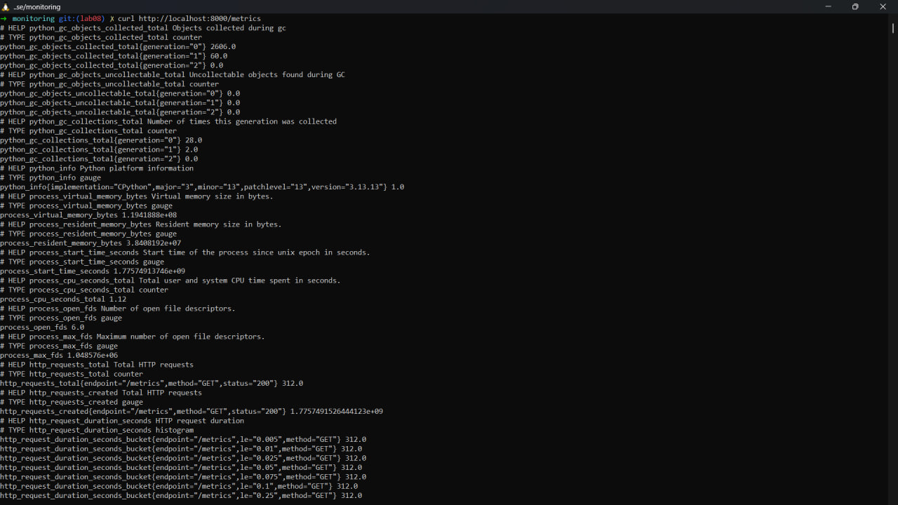
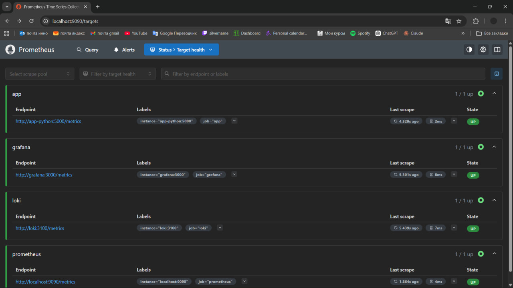
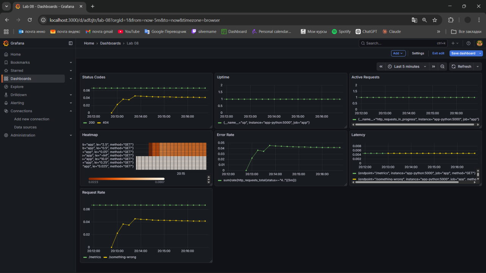
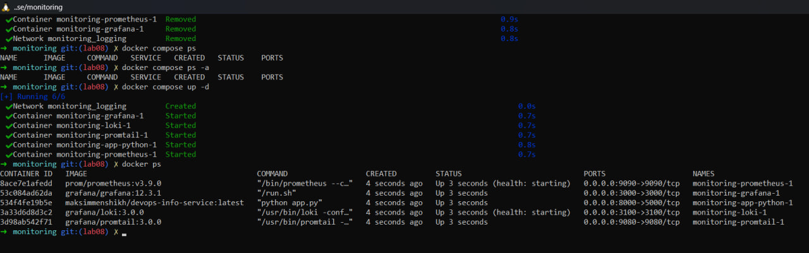

# Lab 8 — Metrics & Monitoring with Prometheus

## 1. Architecture

This lab extends the observability stack by adding metrics collection.

Architecture:
Application → Prometheus → Grafana

- The application exposes metrics via `/metrics`
- Prometheus scrapes metrics every 15 seconds
- Grafana visualizes metrics using PromQL

---

## 2. Application Instrumentation

Metrics were implemented using `prometheus_client`.

### Implemented Metrics

**Counter**
- `http_requests_total` — total number of HTTP requests

**Histogram**
- `http_request_duration_seconds` — request latency distribution

**Gauge**
- `http_requests_in_progress` — number of active requests

**Custom Counter**
- `devops_info_endpoint_calls` — tracks endpoint usage

### Instrumentation Logic

- `before_request`:
  - records start time
  - increments active requests

- `after_request`:
  - calculates duration
  - increments request counter
  - records histogram value
  - decrements active requests

### Metrics Endpoint

```
/metrics
```

Returns Prometheus-formatted metrics.

---

## 3. Prometheus Configuration

### Scrape Interval
- 15 seconds

### Targets

- Prometheus (self-monitoring)
- Python app (`app-python:5000`)
- Loki (`loki:3100`)
- Grafana (`grafana:3000`)

### Key Config

```yaml
global:
  scrape_interval: 15s

scrape_configs:
  - job_name: 'app'
    static_configs:
      - targets: ['app-python:5000']
    metrics_path: '/metrics'
```

### Retention

- Time: 15 days
- Size: 10GB

---

## 4. PromQL Examples

**Request Rate**
```
rate(http_requests_total[5m])
```

**Requests per Endpoint**
```
sum(rate(http_requests_total[5m])) by (endpoint)
```

**Error Rate**
```
sum(rate(http_requests_total{status=~"4.."}[5m]))
```

**Latency (p95)**
```
histogram_quantile(0.95, rate(http_request_duration_seconds_bucket[5m]))
```

**Active Requests**
```
http_requests_in_progress
```

---

## 5. Dashboard

A Grafana dashboard was created with the following panels:

1. Request rate per endpoint
2. Error rate (4xx)
3. Request latency (p95)
4. Latency distribution (heatmap)
5. Active requests
6. Status code distribution
7. Service uptime

---

## 6. Production Configuration

### Security
- Anonymous access disabled in Grafana
- Admin password configured

### Resource Limits
- Prometheus: 1 CPU, 1GB RAM
- Grafana: 0.5 CPU, 512MB RAM
- Loki: 0.5 CPU, 512MB RAM
- App: 0.3 CPU, 256MB RAM

### Health Checks
- Prometheus: `/-/healthy`
- Loki: `/ready`

### Persistence
- Volumes used:
  - prometheus-data
  - loki-data
  - grafana-data

---

## 7. Testing Results

Steps performed:

1. Generated traffic:
```
for i in {1..50}; do curl http://localhost:8000/; done
```

2. Verified:
- `/metrics` endpoint returns data
- Prometheus targets are UP
- Queries return correct values
- Dashboard displays live metrics

---

### 8. Screenshots


*Figure 1: Raw application metrics*

---


*Figure 2: Prometheus targets interface showing the 'UP' status of the service*

---


*Figure 3: Final Grafana dashboard with RPS, Error Rate, etc.*

---


*Figure 4: Service health check verification*


---

## 9. Theory

**What does `http_requests_total` show?**
It counts the total number of HTTP requests processed by the application.

**Why use a histogram?**
Histogram measures distribution of values (e.g., latency), enabling percentile calculations like p95.

**What does `rate()` do?**
It calculates per-second average rate of increase over a time range.

---

## 10. Metrics vs Logs

- Logs: detailed event data (what happened)
- Metrics: aggregated numerical data (how often/how much)

Together they provide full observability.

---

## 11. Challenges

- Ensuring correct ports for scraping
- Debugging missing metrics
- Understanding PromQL syntax

Solutions:
- Verified endpoints manually
- Checked Prometheus targets
- Tested queries in Grafana

---

## Conclusion

A complete monitoring system was implemented using Prometheus and Grafana. The application was instrumented with metrics following best practices, and dashboards were created to visualize system behavior in real time.
